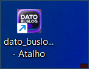
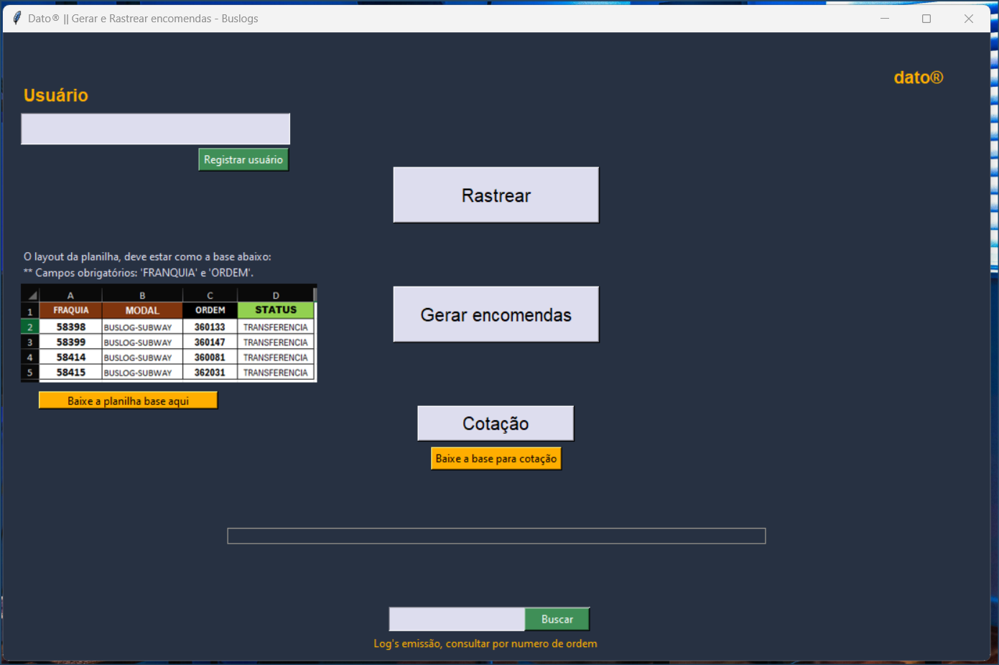

# GERAR E RASTREAR ENCOMENDAS - BUSLOG

## Objetivo: 
- Ganhar agilidade no processo de operação
- Ganhar tempo em prazo de entrega de curto prazo
- Evitar perda de objetos
- Evitar perda de tempo tentando identificar o objeto com a transportadora
- Evitar que a carga fique parada na Base da transortadora (para realizar operações internas, pois os objetos ja estaão prontos para seguir viajem)

### Algumas funcionalidades:
Gerar encomenda, Realizar a cotação em lote de encomendas, rastrear encomendas enviadas 

Nesse projeto atuei como `Desenvolvedor`, construindo uma aplicação permite autenticar uma sessão via API, importar dados de um arquivo Excel, consultar informações de rastreamento de objetos e exportar os resultados para um novo arquivo Excel

Alem disso iniciamos a 2ª fase do projeto que é gerar encomenda na transportado (em fase de desenvolvimento).
A interface gráfica é implementada usando Tkinter.

Nesse projeto atuei como `Desenvolvedor`, construindo uma aplicação permite autenticar uma sessão via API, importar dados de um arquivo Excel e usar como base para consultar informações de rastreamento de objetos, gerar, e realizar cotações.

Para a interface gráfica, foi implementada usando Tkinter.

Para usar o projeto, criamos um execultavel com cxfreeze, para distribuir com a equipe envolvida, assim conseguindo execultar a aplicação com 1 só clique.

Tecnologias aplicadas: Tecnologia: 🎯 Python, API Requests , Pandas, Json, Tkinter, openpyxl.

## Estrutura do Projeto

    ├── authentication/
    │   └── authenticate.py
    ├── banco_de_dados/
    ├── bases/
    ├── consultar_emissao/
    │   └── consultar_bd.py
    ├── consultar_tracking/
    │   └── consultar_objeto.py
    ├── cotacao.py
    │   └── cotar_frete.py
    │   └── validar_cep.py
    ├── exportar_arquivos_base/
    │   └── export.py
    ├── gerar_encomenda/
    │   └── dados_faturamento.py
    │   └── m_gerar_encomenda.py
    │   └── obter_dados_encomenda.py
    ├── inserir_tracking_pedido/
    │   └── inserir_tracking.py
    ├── dato_buslog.py
    ├── interface.py
    ├── .env
    ├── requirements.txt
    ├── setup.py
    └── README.md

## Configuração para execultar a aplicação

## Configuração

1. Criar Ambiente Virtual
`python -m venv venv`

3. Instalar Dependências
`pip install -r requirements.txt`

5. Configurar Variáveis de Ambiente
Crie um arquivo .env na raiz do projeto e adicione a variável TOKEN com seu token de autenticação.
`TOKEN=seu_token_aqui`

## Uso
1. Autenticação de Sessão

O módulo authenticate.py lida com a autenticação usando um token armazenado em um arquivo .env.

2. Consultar Rastreamento de Objetos

O módulo consultar_objeto.py lida com a importação e exportação de arquivos Excel, bem como com a consulta dos dados de rastreamento via API.

3. Gerar encomendas

Na pasta "gerar_encomenda" estão os modulos responsavel para buscar dados em um WMS via API e as mesma informação  enviar od dados na API da transportadora para gerar a encomenda, assim tambem gravando o numero da encomenda no pedido no WMS

4. Cotação

O módulo "cotar_frete" fica responsavel para realizar a cotação (em lote) de possivels encomenda.

5. Executar a Aplicação

O arquivo dato_buslog.py inicializa a aplicação.

Dependências:
requests
pandas
openpyxl
python-dotenv
tkinter.

criar o executavel.
python setup.py build
